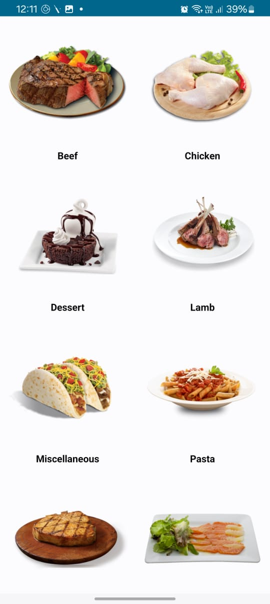
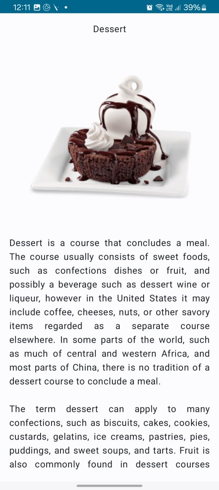

# 🍽️ My Dish App

A simple Android app built using **Kotlin + Jetpack Compose** that fetches and displays dishes using the [TheMealDB API](https://www.themealdb.com/api.php). It shows dish names, images, and brief information — perfect for food lovers who enjoy browsing tasty meals.

---

## ✨ Features

- 🔄 Fetches random or specific dishes from **TheMealDB**
- 📷 Displays dish images, names, and category info
- ⚡ Fast and smooth UI using Jetpack Compose
- 📱 Responsive design for different screen sizes

---

## 📱 Screenshots

| Feature           | Preview                                                      |
|-------------------|--------------------------------------------------------------|
| **Main Screen**   |    |
| **Detail Screen** |  |


## 🛠️ Tech Stack

- Kotlin
- Jetpack Compose
- Retrofit (for API integration)
- Kotlin Coroutines
- MVVM Architecture
- Material Design

---

## 🚀 Getting Started

1. Clone the repository:
   ```bash
   git clone https://github.com/your-username/MyDishApp.git
